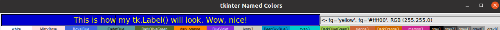
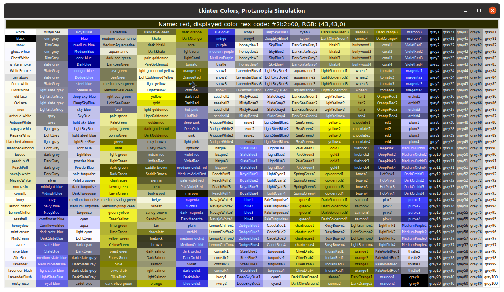
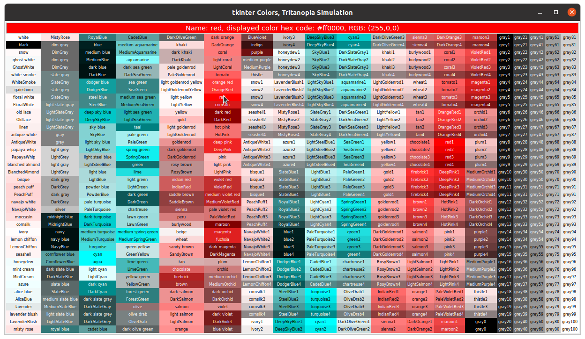
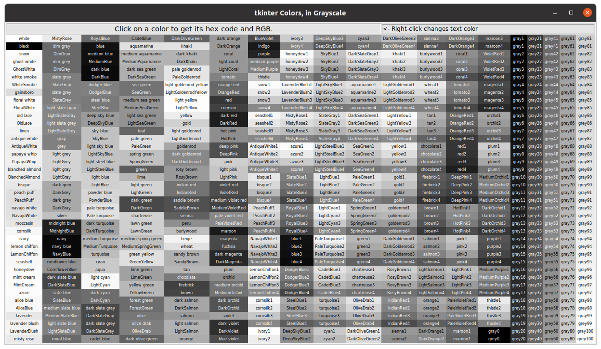

# tkinter_utilities
## tk-color-helper.py
A utility to help choose colors to use in tkinter GUIs or compare with colorblind simulated colors.
A chart is drawn of color names from X11 rgb.txt; names not recognized by tkinter are excluded.
Command line options draw charts that simulate those colors as might be perceived by people having different types of colorblindness. A grayscale chart is also an option. 

To use, click on a color to display it and its tkinter-ready hex code and RGB value. Right-click on a different color to change the display's font color, and show that foreground color name, hex and RGB values. Values can be cut and pasted with standard keyboard and click commands. While values are formatted for direct use in tkinter code, the values themselves can be used for any color format style.
```
$ ./tk-color-helper.py --help
usage: tk-color-helper.py [-h] [--about] [--d] [--p] [--t] [--gray]

optional arguments:
  -h, --help      show this help message and exit
  --about         Provide description, version, GNU license
  --d             Generate deuteranopia simulated colors
  --p             Generate protanopia simulated colors
  --t             Generate tritanopia simulated colors
  --gray, --grey  Generate grayscale equivalents of named colors
```
Run as `./tk-color-helper.py`
Example usage: Click on khaki, then right-click on VioletRed4 to change foreground.


TIP:
Type or paste your own text to replace, or add to, the background color information. (If you remove the color information, don't forget to copy it, so you don't forget that awesome background color.)


Run as `$ ./tk-color-helper.py --d`


Run as `$ ./tk-color-helper.py --p`


Run as `$ ./tk-color-helper.py --t`


Run as `$ ./tk-color-helper.py --gray`


