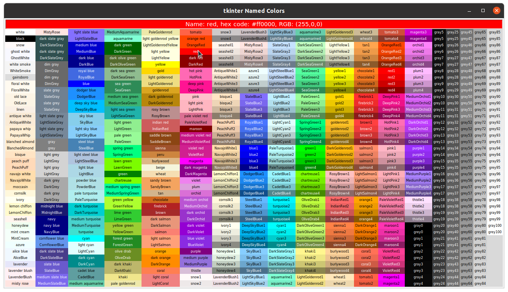
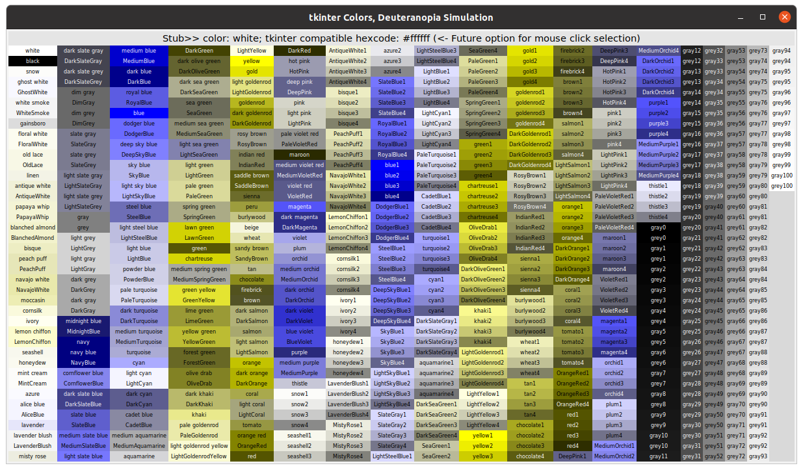

# tkinter_utilities
## tk-color-convert.py
A utility to help choose colors in tkinter GUIs.
Draws a tkinter table of all named colors from X11 rgb.txt.
Command line options will simulate colorblind equivalent colors or 
grayscale equivalents of native named colors.
```
$ ./tk-color-convert.py --help
usage: tk-color-convert.py [-h] [--about] [--d] [--p] [--t] [--gray]

optional arguments:
  -h, --help  show this help message and exit
  --about     Provides description, version, GNU license
  --d         Generates deuteranopia colorblind equivalents
  --p         Generates protanopia colorblind equivalents
  --t         Generates tritanopia colorblind equivalents
  --gray      Generates grayscale equivalents of named colors
```
Run as `./tk-color-convert.py`


Run as `$ ./tk-color-convert.py --d`



