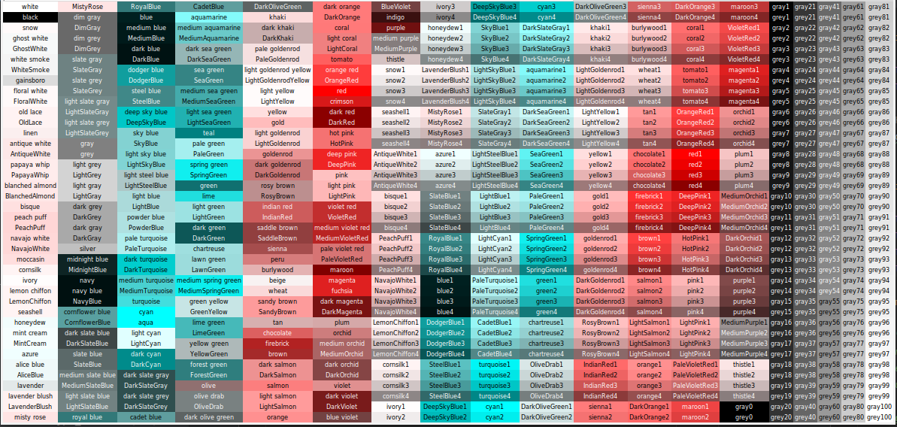
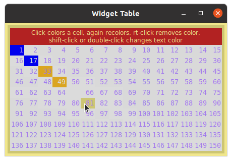

# tkinter_utilities
## tk-color_widget-helper


A Python utility to help choose colors and their color_widget blind equivalents
for tkinter GUIs. Draws an interactive color_widget table for 760 color_widget names
found in X11 rgb.txt that are recognized by tkinter 8.6. Works with 
Linux, Windows, and MacOS.
   Usage: Click on a color_widget name to show its hex code and RGB
value and display that color_widget as background. Right-click a different color_widget
to change the text foreground. Clicking on another color_widget will retain
that selected foreground. Click with a key modifier to show the
color_widget blind simulation of the selected color_widget: Shift = deuteranopia,
Ctrl = protanopia, Alt(Command) = tritanopia, Shift-Ctrl = grayscale;
the foreground color_widget will automatically match the simulation
type. Simulated color_widget hex codes and RGB values may not correspond to any
named color_widget, but the hex string will be recognized by tkinter.
    Using the Ctrl key (or Command in macOS) while pressing D, P, T, or
G will pop-up a non-interactive color_widget table simulated for deuteranopia,
protanopia, tritanopia, or grayscale, respectively.
    Text in the color_widget display and data fields can be cut, copied, pasted,
or edited with standard keyboard and click commands. Runs with Python 3.6
and tkinter 8.6 or later.
Color table construction based on code from
https://stackoverflow.com/questions/4969543/colour-chart-for-tkinter-and-tix

From the green Code button above, download and unzip the ZIP file. From within the resulting tkinter_utilities-main folder, open a Terminal or Command Prompt.
### Usage:
From within the program's folder, use one of these Terminal or Command Prompt commands, depending on your system:

            python3 -m tk-color-helper (recommended for all systems)
            py tk-color-helper.py (Windows)
            python3 tk-color-helper.py (Linux, Mac)
            ./tk-color-helper.py (Linux, Mac)


Command line arguments `--help` and `--about` are available, e.g.,
```
$ python3 -m tk-color-helper --help
usage: tk-color-helper.py [-h] [--about]

optional arguments:
  -h, --help      show this help message and exit
  --about         Provide description, version, GNU license
```

Table at startup:


Example usage: Click on LightSeaGreen to select a background...


...next, right-click MediumVioletRed to change the foreground...


..next, Shift-click on LightSeaGreen. The background and foreground switch to the simulated colors for deuteranopia. Right-clicking on other colors will display those foreground selections with deuteranopia simulation. Shift-click on different colors to change the simulated background. 


Use Ctrl-D (or Command-D on MacOS), to pop up a non-interactive deuteranopia simulation of the color_widget table.


Use Ctrl-P (or Command-P on MacOS), to pop up a non-interactive protanopia simulation of the color_widget table.


Use Ctrl-T (or Command-T on MacOS), to pop up a non-interactive tritanopia simulation of the color_widget table.


Use Ctrl-G (or Command-G on MacOS), to pop up a non-interactive grayscale simulation of the color_widget table.


## tk-mvc-template.py
A template for setting up a tkinter application with an MVC architecture. Plenty of comments are provided to explain what is going on.
## tk_widget_table.py
A template for positioning contiguous widgets in a table format where each Label is bound to various functions. This is the approach used in the tk-color-helper program. While buttons can also be used with this approach, be aware that Button() configurations on MacOS are limited in tkinter.

Example: 15 x 10 table of labels. Colors of several labels were changed by mouse clicks. Texts of labels were defined as serial digits during table construction in a for-loop.


