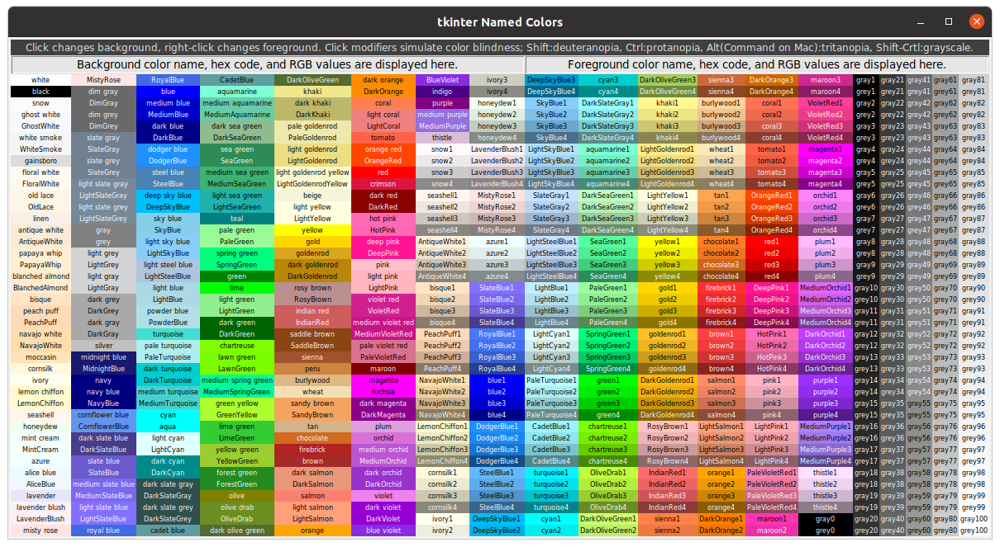

# tkinter_utilities
## tk-color-helper.py

A Python utility to help choose colors and their color blind equivalents
for tkinter GUIs. Draws an interactive color table for 760 color names
found in X11 rgb.txt that are recognized by tkinter 8.6. Works with 
Linux, Windows, and MacOS.
   Usage: Click on a color name to show its hex code and RGB
value and display that color as background. Right-click a different color
to change the text foreground. Clicking on another color will retain
that selected foreground. Click with a key modifier to show the
color blind simulation of the selected color: Shift = deuteranopia,
Ctrl = protanopia, Alt(Command) = tritanopia, Shift-Ctrl = grayscale;
the foreground color will automatically match the simulation
type. Simulated color hex codes and RGB values may not correspond to any
named color, but the hex string will be recognized by tkinter.
    Using the Ctrl key (or Command in macOS) while pressing D, P, T, or
G will pop-up a non-interactive color table simulated for deuteranopia,
protanopia, tritanopia, or grayscale, respectively.
    Text in the color display and data fields can be cut, copied, pasted,
or edited with standard keyboard and click commands. Runs with Python 3.6
and tkinter 8.6 or later.
Color table construction based on code from
https://stackoverflow.com/questions/4969543/colour-chart-for-tkinter-and-tix

From within the tkinter-utilities-main folder, from the Terminal

in Linux or macOS, run as `./tk-color-helper` or as `python3  tk-color-helper`

in Windows Command Prompt, run as `python tk-color-helper`

Command line arguments `--help` and `--about` are available, e.g.,
```
$ ./tk-color-helper --help
usage: tk-color-helper [-h] [--about]

optional arguments:
  -h, --help      show this help message and exit
  --about         Provide description, version, GNU license
```
Table at startup:


Example usage: Click on LightSeaGreen to select a background...


...next, right-click MediumVioletRed to change the foreground...


..next, Shift-click on LightSeaGreen. The background and foreground switch to the simulated colors for deuteranopia. Right-clicking on other colors will display those foreground selections with deuteranopia simulation. Shift-click on different colors to change the simulated background. 


Use Ctrl-D (or Command-D on MacOS), to pop up a non-interactive deuteranopia simulation of the color table.


Use Ctrl-P (or Command-P on MacOS), to pop up a non-interactive protanopia simulation of the color table.


Use Ctrl-T (or Command-T on MacOS), to pop up a non-interactive tritanopia simulation of the color table.


Use Ctrl-G (or Command-G on MacOS), to pop up a non-interactive grayscale simulation of the color table.


## Known Issues
Right-click selection of some long color names may not fit all data into the foreground data cell; it's there, just scroll to the right. You can also 'select all' and copy and paste all the data elsewhere. All basic editing tools are available in either data display cell.
